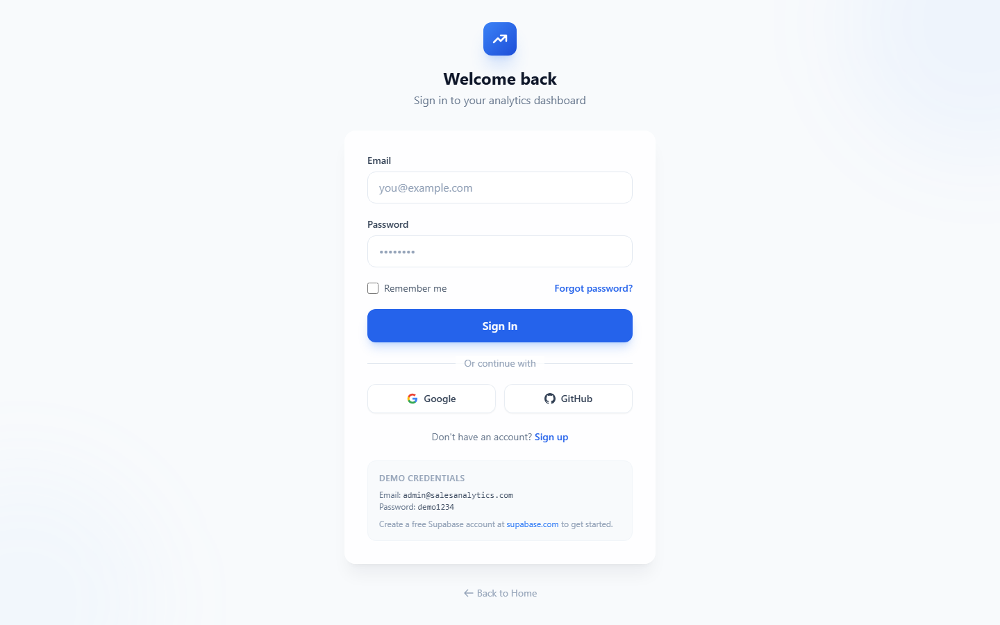

<div align="center">
  <br>
  <div style="display: inline-flex; align-items: center; gap: 12px; padding: 8px 24px; background: linear-gradient(135deg, #2563eb, #1d4ed8); border-radius: 16px;">
    <svg width="28" height="28" viewBox="0 0 24 24" fill="none" stroke="white" stroke-width="2.5" stroke-linecap="round" stroke-linejoin="round">
      <path d="M13 7h8m0 0v8m0-8l-8 8-4-4-6 6"/>
    </svg>
    <span style="color: white; font-size: 20px; font-weight: 700;">Sales Analytics</span>
  </div>
  <br>

  **A full-stack sales analytics platform with interactive dashboards, real-time KPIs, and intelligent reporting.**

  > **📍 Runs locally** — No live demo deployed. Follow the Quick Start guide below to run the app.

  <p>
    
    
    
    
    
    
    
    
  </p>
</div>

---

## ✨ Features

- **📊 Interactive Dashboard** — Real-time KPI cards (revenue, profit, margin, orders), revenue trends, regional performance, and category breakdowns with animated ApexCharts
- **📈 Sales Analysis** — Monthly trends, quarterly performance, and deep-dive filtering by date range and region
- **💰 Profit Analysis** — Margin analysis, profitability by product/category, and cost breakdowns
- **👥 Customer Insights** — Segment analysis, lifetime value (LTV) tracking, retention rates, and customer lists
- **📦 Product Performance** — Top/bottom performers, profitability margins, category analysis
- **🌍 Regional Insights** — Cross-region comparison and growth market identification
- **📄 Report Exporting** — PDF and CSV export with email scheduling support
- **🔐 Authentication** — Django SimpleJWT with email/password login. Role-based access (admin, analyst, viewer). API key auth also supported for programmatic access.
- **🌙 Dark/Light Theme** — System-aware dark mode with manual toggle, persisted to localStorage
- **📱 Responsive Design** — Fully responsive layout for desktop, tablet, and mobile

## 📸 Screenshots

<div align="center">
  
  
  <p style="color: #64748b; font-size: 0.9rem; margin-top: 8px;">
    <strong>Left:</strong> Landing page with hero section, features, and stats
    • <strong>Right:</strong> Login page with email/password sign-in
  </p>
  <br>
  
  <p style="color: #64748b; font-size: 0.9rem; margin-top: 8px;">
    <strong>Dashboard:</strong> KPI cards, revenue trends, regional performance, and category breakdowns with animated ApexCharts
  </p>
</div>

## 🏗️ Tech Stack

**Frontend**
- [Vue 3](https://vuejs.org/) (Composition API + `<script setup>`)
- [Vite](https://vitejs.dev/) (Build tool & dev server)
- [Pinia](https://pinia.vuejs.org/) (State management)
- [Vue Router](https://router.vuejs.org/) (Routing with auth guards)
- [Tailwind CSS](https://tailwindcss.com/) (Utility-first styling)
- [ApexCharts](https://apexcharts.com/) (Interactive charts via `vue3-apexcharts`)
- [Axios](https://axios-http.com/) (HTTP client with JWT interceptors)
- [VueUse](https://vueuse.org/) (Composition utilities & motion)

**Backend**
- [Django](https://www.djangoproject.com/) 5.2 (Python web framework)
- [Django REST Framework](https://www.django-rest-framework.org/) (REST API)
- [SimpleJWT](https://django-rest-framework-simplejwt.readthedocs.io/) (JWT authentication)
- [PostgreSQL](https://www.postgresql.org/) / SQLite (Database)
- [Pandas](https://pandas.pydata.org/) (CSV data import)
- [WhiteNoise](https://whitenoise.readthedocs.io/) (Static file serving)

## 🚀 Quick Start

### Prerequisites
- Python 3.11+
- Node.js 18+
- npm or pnpm
- PostgreSQL 16+ (optional — SQLite works out of the box for local dev)

### 1. Clone & Setup

```bash
git clone https://github.com/VijayaKumarchinta/Sales_analytics.git
cd Sales_analytics
```

### 2. Backend Setup

```bash
cd backend

# Create and activate virtual environment
python -m venv venv
source venv/bin/activate  # On Windows: venv\Scripts\activate

# Install dependencies
pip install -r requirements.txt

# Run migrations (creates tables — uses SQLite by default)
python manage.py migrate

# (Optional) Import sample sales data
python manage.py import_sales_data --clear

# Seed an admin user for first-time login
python manage.py seed_admin --username=admin --password=demo1234 --email=admin@example.com

# Start the dev server
python manage.py runserver
```

The API will be available at **http://localhost:8000/**.

### 3. Frontend Setup

```bash
cd frontend
npm install
npm run dev
```

The app will be available at **http://localhost:5173/**.

### 4. Login

Open the app and navigate to **http://localhost:5173/login** and sign in with the credentials you set during seeding. By default:

- **Username:** `admin`
- **Password:** `demo1234`

Or create additional users through the Django admin panel or directly via the API.

## 🗄️ Database

The project supports both **PostgreSQL** and **SQLite**:

- **Local development** (default): SQLite — zero configuration required
- **Production**: PostgreSQL via environment variables

To switch to PostgreSQL, set these in `backend/.env`:

```env
DB_ENGINE=postgresql
DB_NAME=sales_analytics
DB_USER=postgres
DB_PASSWORD=your-password
DB_HOST=localhost
DB_PORT=5432
```

## 🔐 Authentication

Authentication is powered by **Django SimpleJWT** with dual auth support:

- **JWT tokens** — The frontend sends `Authorization: Bearer <token>` with every request. Tokens auto-refresh on 401 responses.
- **API key auth** — Programmatic clients can use `X-API-Key` header instead of JWT. Both methods work seamlessly.
- **Token endpoints**:
  - `POST /api/token/` — Obtain JWT access + refresh tokens (send `username` + `password`)
  - `POST /api/token/refresh/` — Refresh an expired access token
  - `GET /api/me/` — Get current user profile (requires authentication)
- **User roles** — Backend permission classes support role-based access: admin, analyst, viewer.
- **Router guards** — All `/dashboard/*` routes are protected. Unauthenticated users are redirected to `/login`.

### Seeding an Admin User

```bash
# Auto-generate password (printed to console)
python manage.py seed_admin

# Set a specific password
python manage.py seed_admin --username=admin --password=MySecurePass

# Use environment variable (for production/deployment)
export ADMIN_PASSWORD=MySecurePass
python manage.py seed_admin
```

## 📊 Data Import

The project includes a CSV import command to populate your database with sample data:

```bash
python manage.py import_sales_data           # Import from default CSV
python manage.py import_sales_data --clear   # Clear existing data, then import
```

The CSV file (`sales_analytics_USD.csv`) should be placed in the project root directory.

## 🧪 Testing

```bash
# Frontend tests (Vitest) — 73+ tests
cd frontend && npm test

# Backend tests (Django) — 7+ tests
cd backend && python manage.py test
```

## 📁 Project Structure

```
Sales_analytics/
├── backend/
│   ├── analytics/        # Dashboard KPI views
│   ├── api/              # Shared middleware, error handling, health check
│   ├── api_auth/         # API key authentication + permissions
│   ├── config/           # Django settings & URL config
│   ├── customers/        # Customer management
│   ├── products/         # Product management
│   ├── reports/          # CSV/PDF export & email
│   ├── sales/            # Sales data & import command
│   └── users/            # Custom user model, JWT auth
├── frontend/
│   ├── src/
│   │   ├── components/   # Reusable UI components (Toast, KpiCard, etc.)
│   │   ├── layouts/      # App layout with sidebar
│   │   ├── pages/        # Page components (11 pages)
│   │   ├── router/       # Route definitions & auth guards
│   │   ├── services/     # Axios API client with JWT interceptor
│   │   ├── stores/       # Pinia state stores
│   │   └── styles/       # Global CSS & Tailwind
│   └── package.json
├── render.yaml           # Render deployment config
├── Procfile              # Render process config
├── cloudflare-worker.js  # Cloudflare worker for security headers
└── README.md
```

## 📸 Pages

| Page | Route | Description |
|------|-------|-------------|
| **Landing** | `/` | Marketing homepage with features overview |
| **Dataset Import** | `/dataset/import` | Upload and import CSV sales data |
| **Login** | `/login` | Sign in with username and password (JWT) |
| **Dashboard** | `/dashboard` | KPI cards, revenue trend, regional bar, category donut |
| **Sales Analysis** | `/dashboard/sales` | Monthly & quarterly sales trends |
| **Profit Analysis** | `/dashboard/profit` | Margin & profitability analysis |
| **Customers** | `/dashboard/customers` | Customer list, segments, LTV, retention |
| **Products** | `/dashboard/products` | Product list, top performers, profitability |
| **Regions** | `/dashboard/regions` | Regional performance comparison |
| **Reports** | `/dashboard/reports` | Export PDF/CSV, email scheduling |
| **Settings** | `/dashboard/settings` | Account & application settings |

---

<div align="center">
  Built with ❤️ using Vue 3, Django, SimpleJWT, and AI.
  <br><br>
  <sub>🏠 <a href="https://github.com/VijayaKumarchinta/portfolio">View my complete portfolio</a></sub>
</div>
